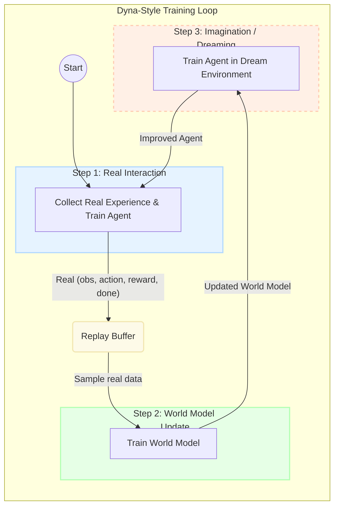
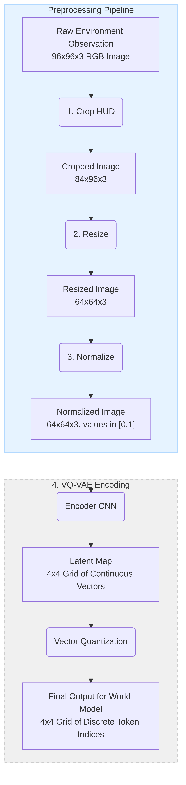
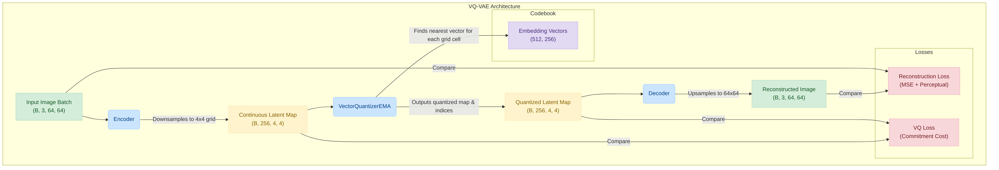
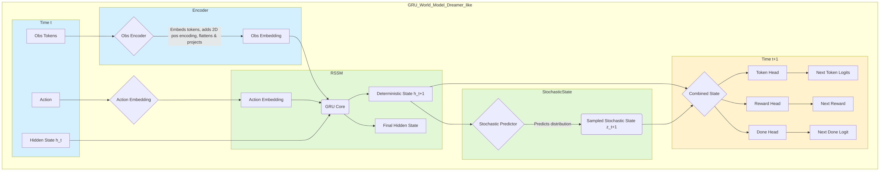
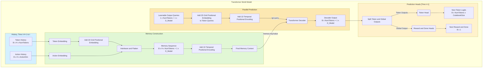

# Bachelor Thesis: Comparative Analysis of GRU and Transformer World Models in Reinforcement Learning

This project contains the implementation for the bachelor thesis titled "Comparative Analysis of GRU and Transformer
Architectures for Model Learning in Reinforcement Learning". It uses a model-based reinforcement learning approach (the
Dyna architecture) to train an agent for the `CarRacing-v3` Gymnasium environment.

## Project Overview

The core of this project is to build and compare two different neural network architectures—a Gated Recurrent Unit (GRU)
and a Transformer—as "world models". These models learn the dynamics of the `CarRacing-v3` environment and are used to
generate simulated ("dreamed") experiences. A reinforcement learning agent is then trained on a mix of real and imagined
data.

The system is composed of three main parts:

1. **Visual Encoder (VQ-VAE):** A Vector-Quantized Variational Autoencoder is trained to compress raw pixel
   observations from the environment into a small, discrete 4x4 grid of tokens. This compressed representation serves as
   the state for the world models.
2. **World Models (GRU & Transformer):**
    * A **GRU-based model**, inspired by the Dreamer architecture, which uses a recurrent state to predict the next grid
      of tokens, reward, and done signal.
    * A **Transformer-based model** that uses an attention mechanism over a history of states and actions to predict the
      next outcome in parallel.
3. **Policy Agent (PPO):** A Proximal Policy Optimization (PPO) agent from the Stable Baselines 3 library is used as the
   controller. It learns a policy by interacting with both the real environment and the "dream" environment generated by
   the world model.

## Overall Architecture

<details>
  <summary><strong>Dyna-Style Training Loop</strong></summary>
  
</details>

## Key Components & Architecture

- **VQ-VAE (`vq_conv_vae.py`):** Uses a deep convolutional encoder to create a latent map, which is then quantized using
  a codebook trained with Exponential Moving Average (EMA) updates. A corresponding decoder reconstructs images from the
  quantized latents. The training is stabilized with a perceptual (LPIPS) loss and a mechanism to reset dead codebook
  vectors.

  <details>
    <summary><strong>Observation Preprocessing and VQ-VAE Pipeline</strong></summary>
    
    <br/>
    <em>The end-to-end pipeline from raw pixels to the token grid used by the world models.</em>
    <br/><br/>
    
    <br/>
    <em>A detailed view of the VQ-VAE architecture.</em>
  </details>

- **GRU World Model (`world_model.py`):** A modern, Dreamer-like recurrent model. It processes a sequence of actions and
  encoded observations to update its internal state (composed of deterministic and stochastic parts) and predicts the
  entire next observation grid, reward, and done signal in a single forward pass.

  <details>
    <summary><strong>GRU World Model Architecture</strong></summary>
    
  </details>

- **Transformer World Model (`transformer_world_model.py`):** A history-based model that uses a Transformer decoder. It
  takes a sequence of past token grids and actions as a "memory context" and uses a set of learnable queries to predict
  the next state's tokens in parallel via cross-attention. It uses a dedicated global query token for reward and done
  prediction.

  <details>
    <summary><strong>Transformer World Model Architecture</strong></summary>
    
  </details>

- **PPO Agent (`train_ppo_sb3.py`, `train_dyn_transformer.py`):** The SB3 PPO implementation is used. For feature
  extraction from raw pixels (in the baseline and Dyna training), a custom Impala-style CNN (`impala_cnn.py`) is used.

## Key Scripts

- `train_vq_vae.py`: Trains the VQ-VAE to encode environment observations.
- `train_world_model_parallel.py`: Trains the GRU-based world model on data collected in parallel.
- `train_transformer_world_model.py`: Trains the Transformer-based world model.
- `train_ppo_sb3.py`: Trains a baseline PPO agent on the real environment.
- `train_dyn_transformer.py`: Runs the main Dyna-style training loop, alternating between real-world interaction, world
  model training, and agent training in the dream environment.
- `play_game_sb3.py`: Visualizes a trained PPO agent playing in the environment.
- `dreaming_render.py` / `dreaming_render_transformer.py`: Generates videos of dream sequences from a trained world
  model.
- `play_in_dream.py` / `play_in_dream_transformer.py`: Allows for interactive "gameplay" within the world model's dream.

## Setup and Usage

1. **Clone the repository:**
   ```bash
   git clone git@github.com:Emtrixx/car-racing-world-model.git
   cd car-racing-world-model
   ```

2. **Create a Python virtual environment (recommended):**
   ```bash
   python -m venv venv
   source venv/bin/activate  # On Windows use `venv\Scripts\activate`
   ```

3. **Install dependencies:**
   ```bash
   pip install -r requirements.txt
   ```

4. **Training Steps (Example Workflow):**

   The recommended training process follows these steps:

    * **Step 1: Train a Baseline PPO Agent.**
      A capable PPO agent is first trained on the real environment. This agent's policy is then used to collect a
      high-quality dataset of experiences, which is more effective for training the world models than using a random
      policy.
      ```bash
      # Train the baseline PPO agent and save the model
      python -m src.train_ppo_sb3 --config default
      ```
      This will save the best model in the `checkpoints/sb3_checkpoints/` directory. You will use this model in the next
      step.

    * **Step 2: Train the VQ-VAE.**
      You must first collect data using your trained agent, and then train the VQ-VAE on that data.
      ```bash
      # Collect 1,000,000 frames from the environment and train the VQ-VAE
      # TODO: This script needs to be adapted to take the agent from step 1
      python -m src.train_vq_vae --config default --collect
      ```

    * **Step 3: Train a World Model (Optional, for separate evaluation).**
      You need a dataset first, which should be collected with the agent from Step 1.
        ```bash
        # Collect data for the Transformer WM and train the transformer world model
        python -m src.train_transformer_world_model --config default --save-data-to data/transformer_world_model_data
        ```
        ```bash
        # Collect data for the GRU WM and train the GRU world model
        python -m src.train_world_model_parallel --config default --save-data-to data/gru_world_model_data
        ```

    * **Step 4: Run the full Dyna training.**
      This trains the agent and world model together from scratch and is the final step.
      ```bash
      # Run Dyna training with the Transformer world model
      python -m src.train_dyn_transformer --world-model-type transformer --config default
 
      # Run Dyna training with the GRU world model
      python -m src.train_dyn_transformer --world-model-type gru --config default
      ```

## Troubleshooting & Notes

- The project was developed with Python 3.11 and PyTorch 2.7.0+cu123.
- If you encounter library issues on Linux, you may need to force conda/pip to handle `libgcc` correctly:
    - `conda install -c conda-forge libgcc-ng libstdcxx-ng`
- The `OpenEvolve` library can be installed for experimental code evolution features:
    - `pip install git+https://github.com/codelion/openevolve.git`

